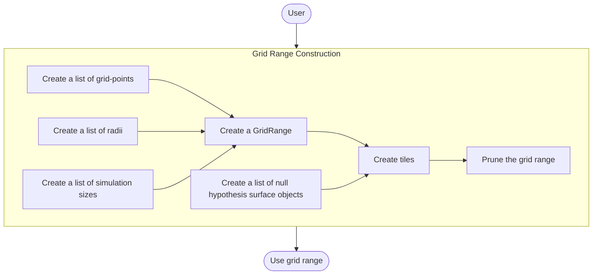
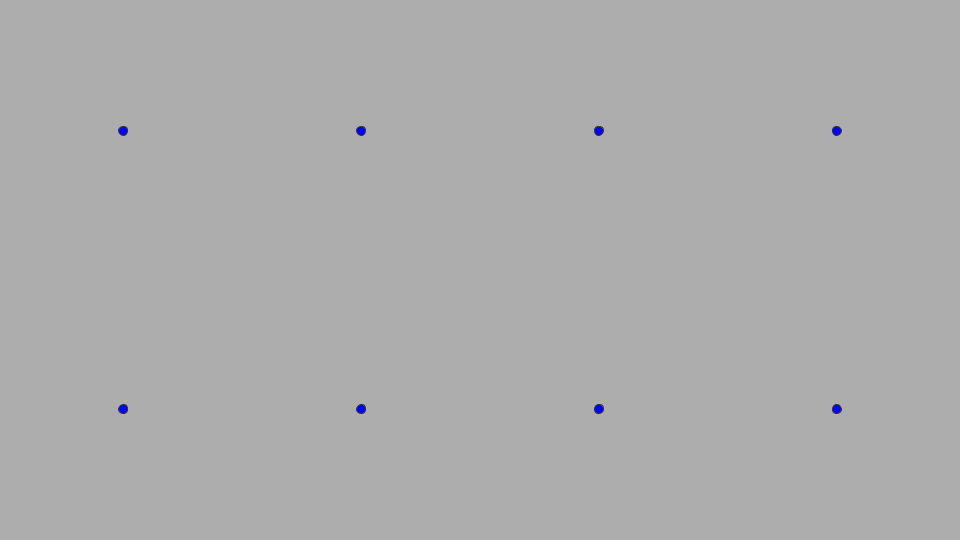
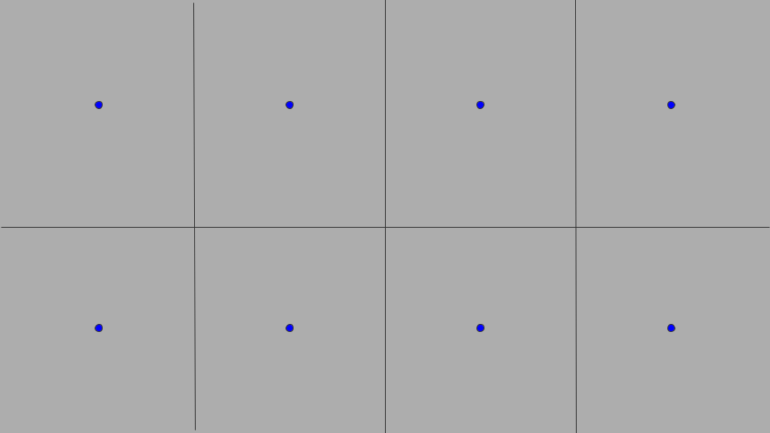
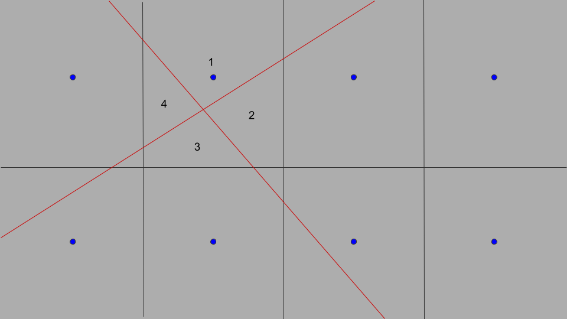
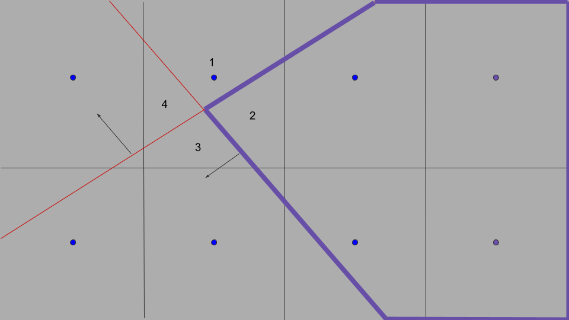

# Grid Range

In general, `kevlar` requires a notion of "a set of grid-points"
on which to simulate a given model.
As it turns out, we require a few more additional detail
to be able to integrate grid range into the framework.
This document covers the specification and the API
for our grid range class.

## Overview

A typical workflow of using a grid range is described below:

The following sections discuss in further detail
the subroutines depicted as rectangular tiles in the diagram above.

## Grid Range Specification

This section covers the required specification 
of a grid range concept.
Throughout this section, we will illustrate many concepts
using a running example of a user-defined grid-space.

### Grid-points

The first and foremost requirement is to store a list of grid-points.
As mentioned in [Grid Range](#grid-range),
this is the set of grid-points under which we simulate a given model.
An example is shown below with blue dots representing the grid-points
and the gray-space representing the grid-space of interest:

    

Note that the context, or meaning, of these points is defined by the model of interest.
See [Model](../model/model.md#attaching-gridrange) for more detail.
The user is responsible for constructing a valid list of grid-points
that adhere to the convention of the model of interest.

However, regardless of the context, 
a range of grid-points is still a meaningful quantity 
for the rest of the framework.
The framework only ever assumes that the grid-points lie in the space in which
we apply the Taylor expansion of the function of interest (e.g. Type I error function)
(see [KevlarBound](../../../math/bound/doc.pdf)).

### Radii

In [KevlarBound](../../../math/bound/doc.pdf),
the Type I error guarantees originate from having control of a Taylor expansion
around a small region `R` associated with each grid-point.
While it is true that `R` need not contain the corresponding grid-point,
accuracy is improved when it does. 
So, if a user has a grid-space they wish to get Type I error guarantees on,
we will assume that the space has been first partitioned by a set of hypercubes
where each hypercube is defined by a grid-point as in [Grid-points](#grid-points)
as the center and a radius vector that defines the radius along each direction.
The following pictures shows an example of a grid partitioned by
hypercubes with the same radius:

    

### Simulation Sizes

For each grid-point that we wish to simulate under,
we can associate it with a simulation size (number of simulations).
In general, we would like to have different simulation sizes
for each grid-point because some points will result in a higher Type I error than others
and we wish to get a more accurate estimate in those regions.
During simulation, we can keep track of the number of finished simulations
and stop updating for those that reached the desired simulation size.

### Null Hypothesis Surfaces

A vector of "null-hypothesis surfaces" is needed to create tiles 
(see [Tiles](#tiles)).
A null-hypothesis surface is a surface that splits a space
into three portions: negative orientation, positive orientation, and boundary.
The positive orientation and the boundary is one half of the space split by the surface
that is assumed to be associated with the null-hypothesis.
The negative orientation is the alternative space.
The most common type of a null-hypothesis surface is a hyperplane.
It is motivated by examples of the form `theta_i <= theta_0`,
where the hyperplane is of the form `(1,0,...,0,-1,0,...)` where 
the `-1` is in the ith position (0-indexed) with a `0` shift.

### Tiles

Once the grid-point, radius, simulation size, 
and null hypothesis surface information are provided,
we can construct tiles.
A tile is simply a hypercube mentioned in [Radii](#radii)
intersected by all null-hypothesis surfaces.
Naturally, a vector of null-hypothesis surfaces partition
the given grid space into disjoint tiles.
These tiles are precisely the regions on which we Taylor-expand
and compute our Kevlar bounds.
Associated with each tile is an _intersection hypothesis space_ (IHS)
defined by the configuration of the null-hypothesis space.
Since each tile belongs to one partition of the null-hypothesis surfaces,
it is associated with exactly one of 2 configurations for each hypothesis
(in the null vs. in the alternative).
An IHS is simply the full configuration of all null-hypotheses 
(e.g. (1,0,1) represents 1st and 3rd hypotheses as null and the 2nd as alternative).
The following is an example of a grid-range with 2 hyperplanes as null-hypothesis surfaces.

    

The 2nd tile on the top has both hyperplanes cutting the hypercube
with the 4 tiles labeled from 1-4.
__Note: currently for simplicity, if more than one hyperplane cuts a tile,
no further cutting occurs and the current tile simply gets copied and labeled
as on the negative/positive orientation, respectively.
This does not break the math - it simply makes it more conservative.__
The neighboring tiles are only cut by one hyperplane.
The right-most column of tiles are not cut by any of the hyperplanes.

### Pruning

After tiles have been created, the user has the option to prune the tiles/grid-points.
Since tiles associated with fully-alternative configuration is completely
unnecessary for studying the Type I error, 
we can preemptively prune those tiles out.
Moreover, if there are no tiles associated with a grid-point,
the grid-point itself can be pruned out, lowering the cost of simulation.
The following diagram shows the positive orientation of each of the hyperplanes,
the purple lines delineate the set of tiles which get pruned,
and the purple dots denote the grid-points which get pruned out as well.

    

