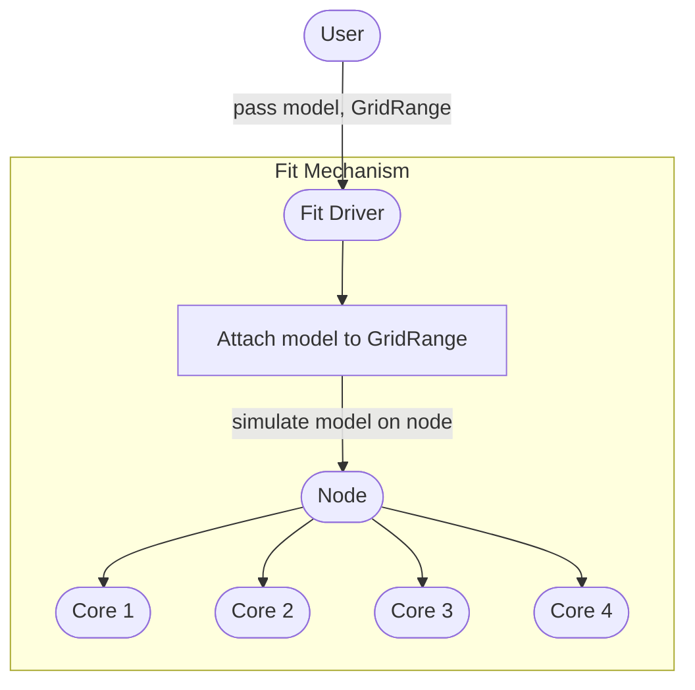
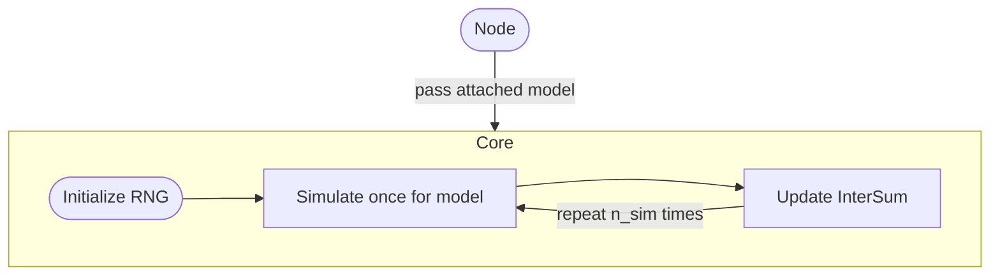
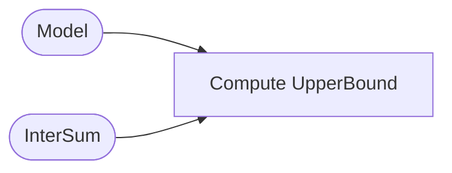

# Model

Model classes are at the heart of `kevlar`
as they define all simulation-specific routines,
model-specific upper bound quantities,
and any global configurations for the model.
This document will explain in detail the design of our model classes.

## Overview

The following diagram shows how a `model` fits into the whole framework.
For simplicity, we assume that the cloud only consists of one node with four cores.

The first diagram depicts only the key parts of 
the simulation framework that interact with a `model`.

We refer to [TODO: link a page about `GridRange`]()
for more information about the `GridRange` class
and terminologies.

We see that nearly all of the interactions with `model` occurs in the cores.
The following diagram shows a close-up flowchart of the core mechanism.

We refer to [TODO: link a page about `InterSum`]()
for more information about the `InterSum` class
and terminologies.

Aside from the simulation mechanism,
we also have the upper-bound mechanism where the framework
interacts with a `model` and its corresponding `InterSum` object
to compute the corresponding `UpperBound` object.
The following diagram describes this interaction:

In the subsequent sections, we will discuss each of the 
subroutines in the diagrams depicted by the rectangular nodes
to see how they interact with a `model`.
Combining will give us a sketch of the `model` API.
We will then describe our implementation of the API.

## Model Specification

This section will cover the subroutines mentioned in [Overview](#overview).
The last subsection will combine the information needed from a `model`
by each of the subroutines as a summary.

### Attaching `GridRange`

Every `model` should have the opportunity to cache information
from the given `GridRange` object before any simulations occur.
For example, if a `model` defines the grid to be in some space
that parametrizes the mean parameter space of the exponential family,
it is usually advantageous to compute the mean parameters 
for each grid-point in `GridRange`,
since quantities such as the log-partition function
can be computed simply in terms of the mean parameters.

[Simulating](#simulating) gives another justification
for having `models` attach to a `GridRange`.

__In summary__:
- The framework guarantees that a `model` will be attached
to a `GridRange` on which it will simulate.
- The attaching procedure gives the opportunity for a `model` to cache
any information that can potentially speed-up the simulations.

### Simulating

A `model` needs to define the simulation procedure
beginning with the data generation to computing the false rejections for each tile of `GridRange`.

It is important that the `model` is aware of the `GridRange` ahead of time.
From an optimization point of view, this is extremely crucial.
As a simple example, consider a binomial distribution with size `n` 
and parameters `p_i` for `i=1,...,d` (`d` grid-points).
Using Skhorokhod's embedding, it is enough to sample 
_`n` uniform random variables_ `U_j` (`j=1,...,n`) and evaluate the indicators
that `U_j < p_i`.
This is because such an indicator follows a Bernoulli with parameter `p_i`
and the sum over `j` will give us a binomial distribution with size `n`, parameter `p_i`.
This certainly correlates the binomials for each of the parameters `p_i`,
but this _does not_ invalidate our math.
Furthermore, assuming `U_j` and `p_i` are sorted,
we can compute _all_ binomials by reading `U` and `p` exactly once.
Note that this optimization is only possible because 
a `model` attaches itself to the full `GridRange`.
Moreover, if the model assumes independent binomial draws for `k` arms
and there are `d` grid-points, 
it is enough to only save the _unique_ parameter values for each arm,
and hence, enough to only compute binomials for these unique parameters.
For this particular binomial model, the number of unique parameter values
is typically `O(log(d))`, which introduces massive memory and computation savings.

After sampling the RNG,
we typically have to further compute the sufficient statistic,
e.g. for the binomial example, the binomials are the sufficient statistic.
Note that an exponential family only depends on the data through the sufficient statistic,
so the test statistic used in computing false rejections 
should (in principle) only depend on the sufficient statistic.
However, it is entirely up to the user how to sample RNG and save the necessary information
(sometimes we may need to save a quantity other than the sufficient statistic!).
The user has complete autonomy in deciding what data structure is most
beneficial for the simulation procedure.

Lastly, the simulation procedure must
compute the false rejections for all tiles in `GridRange`.
Note that from the framework perspective, 
the model is free to choose the meaning of "false rejection"
(e.g. controlling FWER).

__In summary__:
- A `model` is given an RNG and must provide a simulation function that (conceptually):
    - Generates data for each grid-point.
    - Saves any necessary information (usually sufficient statistic).
    - Computes "false rejection" (defined model-specifically) for each tile.

### `InterSum` Update

An `InterSum` object essentially stores the sum of false rejections
and the gradient estimates for each tile in the attached `GridRange` object of the `model`
(see [TODO: link `InterSum` page]() for more information).
Recall that an `InterSum` contains the minimal simulation-dependent information
needed to create an `UpperBound` object.
The simulation-dependent information is precisely:

- False rejections for each tile in `GridRange`.
- Score estimates for each grid-point in `GridRange`.

See the [UpperBound](../math/stats/upper_bound/doc.pdf) document 
for the mathematical details for why this the case.

The false rejections per tile have already been discussed in [Simulating](#simulating).
The only extra information needed from `model` is then the score estimate.

__In summary__:
- After a simulation of a `model`, 
the `InterSum` object is updated to accrue information.
- For this update, it only requires:
    - False rejections for each tile.
    - Score estimates for each grid-point.

### `UpperBound` Update

An `UpperBound` object stores the components that comprise the upper bound estimate.
It is computed from a `model`, its attached `GridRange` object, 
and its corresponding `InterSum` object that accrued information across all the simulations.
The only model-specific quantities are:

- Jacobian of parameter transform.
- Quadratic form of the covariance of the sufficient statistic.
- Maximum 
