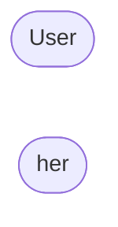

# Model

Model classes are at the heart of `kevlar`
as they define all simulation-specific routines,
model-specific upper bound quantities,
and any global configurations for the model.
This document will explain in detail the design of our model classes.

## Overview

The following diagram shows how a model object fits into the whole framework.

