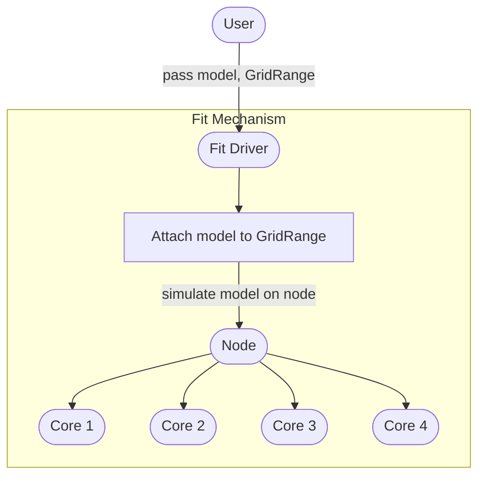
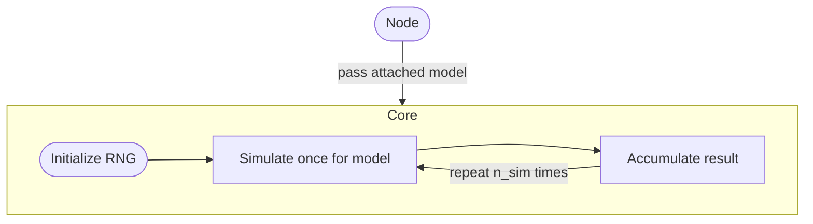
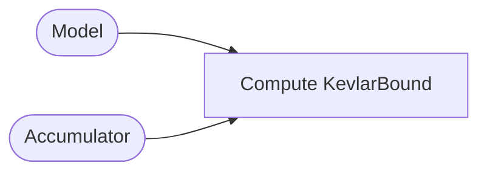
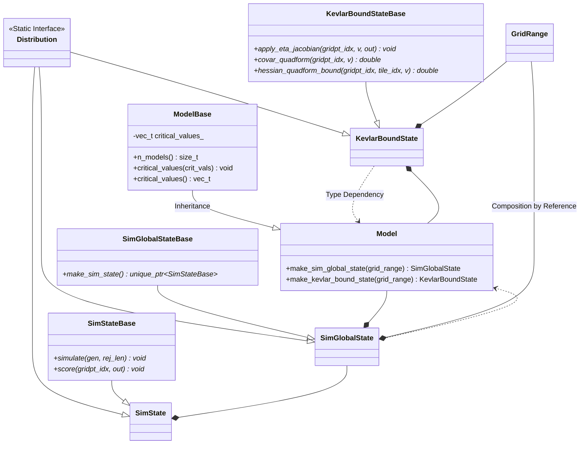

# Model

Model classes are at the heart of `kevlar`
as they define all simulation-specific routines,
model-specific kevlar bound quantities,
and any global configurations for the model.
This document will explain in detail the design of our model classes.

## Table of Content

- [Overview](#overview)
- [Model Specification](#model-specification)
    - [Attaching `GridRange`](#attaching-gridrange)
    - [Simulating](#simulating)
    - [`Accumulator` Update](#accumulator-update)
    - [`KevlarBound` Update](#kevlarbound-update)
- [Model API](#model-api)
    - [`Distribution`](#distribution)
    - [`Model` and `ModelBase`](#model-and-modelbase)
    - [`SimGlobalState` and `SimGlobalStateBase`](#simglobalstate-and-simglobalstatebase)
    - [`SimState` and `SimStateBase`](#simstate-and-simstatebase)
    - [`KevlarBoundState` and `KevlarBoundStateBase`](#kevlarboundstate-and-kevlarboundstatebase)
    - [Virtual Members](#virtual-members)

## Overview

The following diagram shows how a `model` fits into the whole framework.
For simplicity, we assume that the cloud only consists of one node with four cores.

The first diagram depicts only the key parts of 
the simulation framework that interact with a `model`.

We refer to [TODO: link a page about `GridRange`]()
for more information about the `GridRange` class
and terminologies.

We see that nearly all of the interactions with `model` occurs in the cores.
The following diagram shows a close-up flowchart of the core mechanism.

Aside from the simulation mechanism,
we also have the kevlar-bound mechanism where the framework
interacts with a `model` and an accumulator object
that has accrued information from simulations with that `model`
to compute the corresponding `KevlarBound` object.
The following diagram describes this interaction:

In the subsequent sections, we will discuss each of the 
subroutines in the diagrams depicted by the rectangular nodes
to see how they interact with a `model`.
Combining will give us a sketch of the `model` API.
We will then describe our implementation of the API.

## Model Specification

This section will cover the subroutines mentioned in [Overview](#overview).

### Attaching `GridRange`

Every `model` should have the opportunity to cache information
from the given `GridRange` object before any simulations occur.
For example, if a `model` assumes the grid lies in some space
that parametrizes the mean parameter space of the exponential family,
it is usually advantageous to transform the grid-points
into the mean parameters first before any simulations occur,
since simulation-dependent quantities such as the log-partition function
can usually be computed cheaply in terms of the mean parameters.
[Simulating](#simulating) gives another justification
for having `models` attach to a `GridRange`.

As mentioned in the previous paragraph,
a `model` defines the context of the grid-points.
It is the user's responsibility to construct a `GridRange` object
that adheres to the convention of the `model` they wish to simulate.
For example, a `model` assuming exponentially distributed data
may define the grid-points to lie in the log-hazard space
rather than the natural parameter space (negative hazard).
The user is then responsible for constructing grid-points
in the log-hazard space.
This promise is solely between the user and the `model` of interest;
the rest of the `kevlar` framework does not use the context of a `GridRange` object
for a given `model`, since they must be agnostic to the `model` types.

__In summary__:
- The framework guarantees that a `model` will be attached
to a `GridRange` on which it will simulate.
- The attaching procedure gives the opportunity for a `model` to cache
any information that can potentially speed-up the simulations.
- A `model` defines the context of the grid-points.
It is the user's responsibility to construct grid-points in the expected space that they belong.

### Simulating

A `model` needs to define the simulation procedure
beginning with the data generation to computing the false rejections for each tile of `GridRange`.

From an optimization point of view, 
it is important that the `model` is aware of the `GridRange` ahead of time.
As a simple example, consider a (one-arm) binomial distribution with size `n` 
and parameters `p_i` for `i=1,...,d` (`d` grid-points).
Using Skhorokhod's embedding, it is enough to sample 
_`n` uniform random variables_ `U_j` (`j=1,...,n`) and evaluate the indicators
that `U_j < p_i`.
This is because such an indicator follows a Bernoulli with parameter `p_i`
and the sum over `j` will give us a binomial distribution with size `n`, parameter `p_i`.
This certainly correlates the binomials for each of the parameters `p_i`,
but this __does not__ invalidate our math.
In fact, this correlation only helps smooth-out the Type I error profile.
Furthermore, assuming `U_j` and `p_i` are sorted,
we can compute _all_ binomials by reading `U` and `p` _exactly once_.
Moreover, if the model assumes independent binomial draws for `k` arms
and there are `d` grid-points, 
it is enough to only save the _unique_ parameter values for each arm,
and hence, enough to only compute binomials for these unique parameters.
For this particular binomial model, the number of unique parameter values
is typically `O(log(d))`, which introduces massive memory and computation savings.
Note that this optimization is only possible because 
a `model` is aware of the whole range of grid-points.

After sampling the RNG,
we typically have to further compute the sufficient statistic,
e.g. for the binomial example, the binomials are the sufficient statistic.
Note that an exponential family only depends on the data through the sufficient statistic,
so the test statistic used to compute false rejections 
should (in principle) only depend on the sufficient statistic.
However, it is entirely up to the user how to sample RNG and save the necessary information
(sometimes we may need to save a quantity other than the sufficient statistic!).
The user has complete autonomy in deciding what data structure is most
beneficial for the simulation procedure.

Lastly, the simulation procedure must
compute the false rejections for all tiles in `GridRange`.
Note that from the framework perspective, 
the model is free to choose the meaning of "false rejection"
(e.g. controlling FWER).

__In summary__:
- A `model` is given an RNG and must provide a simulation function that (conceptually):
    - Generates data for each grid-point.
    - Saves any necessary information (usually sufficient statistic).
    - Computes "false rejection" (defined model-specifically) for each tile.

### `Accumulator` Update

An `Accumulator` object essentially stores the necessary simulation-specific information
needed to compute its corresponding kevlar-bound.
Depending on the function of interest (e.g. Type I Error, bias, MSE),
we may have different quantities in general that are needed to compute their respective kevlar bound.
As an example, Type I Error accumulator will save the sum of false rejections
and the score estimates for each tile in the attached `GridRange` object of the `model`
(see [TODO: link `Accumulator` page]() for more information).
See [TODO: KevlarBound page instead?](../math/stats/kevlar_bound/doc.pdf) 
for the mathematical details for why this the case.

The false rejections per tile has already been discussed in [Simulating](#simulating).
The only extra information needed from `model` is then the score estimates.

__In summary__:
- After a simulation of a `model`, 
the `Accumulator` object is updated to accrue simulation information.
- As an example, Type I Error accumulator only requires:
    - False rejections for each tile.
    - Score estimates for each grid-point.

### `KevlarBound` Update

An `KevlarBound` object stores the components that comprise the kevlar bound estimate.
It is computed from a `model`, its attached `GridRange` object, 
and its corresponding `Accumulator` object that accrued information across all the simulations.
The only model-specific quantities are:

- Jacobian operator of the transformation that maps grid-points to natural parameters.
- Quadratic form of the covariance of the sufficient statistic.
- Kevlar bound on the quadratic form of the hessian.

We explain the reasoning at a high-level.
The first quantity is required since a `model` defines 
the space in which the grid-points lie,
and `KevlarBound` requires the Jacobian of the transform
that maps grid-points to the natural parameters.
Hence, this Jacobian is a model-specific quantity.
The second and third quantities are obviously model-specific
since a model assumes a particular data distribution
and both quantities are dependent on that distribution.
See [KevlarBound](../math/stats/kevlar_bound/doc.pdf) 
for further mathematical details.
See [Exponential Model](../math/model/exp_control_k_treatment/doc.pdf)
for a concrete example of these specifications.

## Model API

In this section, we discuss the Model API and remark on the design choices.
The following class diagram describes a typical model class `Model`.
Note that the diagram is a simplification of our implementation;
we only present the essential class members for our discussion.

We list the diagram notation definitions:
- `-`: private.
- `+`: public.
- `: name`: `name` is the return type.
- Italicized functions are `virtual` or `pure virtual`.
- Arrows with triangular tips represent `Inheritance` (example shown).
- Arrows with rhombus tips represent `Composition by Reference` (example shown).
- Arrows with dashed lines and angled tips represent `Type Dependency` (example shown).
- `Distribution`: a class with a static interface for computing quantities
specific to a particular distribution (e.g. binomial).
- `GridRange`: a grid range class.
- `Model`: concrete model class.
- `SimState`: concrete simulation state class associated with `Model`.
- `SimGlobalState`: concrete simulation global state class associated with `Model`.
- `KevlarBoundState`: concrete kevlar bound state class associated with `Model`.
- All class names of the form `FooBase` are base classes for
their corresponding derived classes `Foo`. 

The following subsections will cover the design choices 
for the classes in the diagram.

### `Distribution`

`Distribution` is a class with a static interface for computing quantities
specific to a particular distribution.
The purpose of this class is to isolate and modularize
the expressions for such quantities so that these expressions
are not duplicated within the codebase.
So, different models, which may assume the same distribution,
do not have to re-implement the logic of distribution-specific quantities,
such as the score function.

In general, distribution-specific quantities are present in
- `SimState` (e.g. score function)
- `SimGlobalState` (e.g. natural parameter to mean parameter transformation)
- `KevlarBoundState` (e.g. covariance quadratic form)

### `Model` and `ModelBase`

The `Model` class should be interpreted as a collection of policies.
It is simply a dispatcher to create sibling classes for a particular routine
and store any model-specific configuration data.
Note that `Model` contains two member functions which create
an instance of `SimGlobalState` and `KevlarBoundState`.
These sibling classes will be discussed in further detail in the later sections,
but at a high level, `SimGlobalState` is a class used in simulation
and `KevlarBoundState` is a class used to construct an kevlar bound estimate.
`Model` itself does not interact with the framework otherwise.
The sibling classes are constructed with an instance of a `GridRange` object,
`grid_range`.
It is precisely here where we "attach" a `GridRange` object to a model
as discussed in [Attaching `GridRange`](#attaching-gridrange).

Looking slightly ahead, we see that `Model`'s `make_*` functions
return the derived classes themselves rather than `unique_ptr`s.
Of course, we could have returned `unique_ptr`s,
but here we can avoid the unnecessary heap-allocation,
since we are not attempting to return abstract types.

The `ModelBase` class is a base class to all model types.
Currently, the only property in common among all model types is that
we can define a __sequence of models__.
For now, we enforce that a sequence of real numbers index this sequence of models.
In particular, in all our use-cases, this sequence will represent the critical values
for which we reject our test-statistic of a given model.
__Note: the context of these critical values is _model-specific_!__
Every concrete `Model` class decides its own meaning of these critical values
(e.g. critical values associated with lower-sided, upper-sided, or two-sided test; 
scaling of the critical values, e.g. z-score values, chi-squared values, etc.).
These critical values are only ever used within `Model`-related classes,
so the user is free to decide the context;
`Accumulator` and `KevlarBound` objects never work with these critical values directly.
The critical values solely exist to define the sequence of models
and to compute the false rejections during simulations.

### `SimGlobalState` and `SimGlobalStateBase`

`SimGlobalState` is a class that represents a concrete `Model` class
attached to a `GridRange` object.
The primary goal of this object is to cache any global information
that can be used by all simulations to potentially speed them up
(see [Simulating](#simulating)).
__The user is free to choose the internal representation
of these concrete `SimGlobalState` types
and expose any members that are needed by `SimState`.__
This class only interacts with `SimState`.

`SimGlobalStateBase` is the corresponding base class.
It instructs all derived classes to implement
`make_sim_state`, which creates a new `SimState` object
(casted down to the abstract base type `SimStateBase`).
See [Virtual Members](#virtual-members) for why
this function is made `virtual`.

### `SimState` and `SimStateBase`

`SimState` is a class that represents a simulation state
for the `Model` class under the global cache of `SimGlobalState`.
At a high level, this class contains any members that stores
simulation-specific information and member functions that compute
simulation-specific quantities using model-specific values
and pre-computed information about the current `GridRange` object.
__The user is free to choose the internal representation
of these concrete `SimState` types.__

`SimStateBase` is the corresponding base class.
It instructs all derived classes to implement the virtual member functions:
- `simulate`: runs one simulation and outputs the false rejections
for each tile in the current `GridRange` object
(see [Simulating](#simulating)).
- `score`: computes the score function evaluated at a grid-point
and one of the parameters
(see [`Accumulator` Update](#accumulator-update)).

### `KevlarBoundState` and `KevlarBoundStateBase`

`KevlarBoundState` is a class associated with `Model`
that is used to create an `KevlarBound` object.
It implements the members of `KevlarBoundStateBase`,
which are the only members needed to create an kevlar bound estimate
(see [`KevlarBound` Update](#kevlarbound-update)).
__The user is otherwise free to choose the internal representation
of these concrete `KevlarBoundState` types.__

### Virtual Members 

At first glance, it seems arbitrary that
some member functions are declared `virtual` in a base class
and others are not.
However, the choice was deliberate.

In our framework, there are C++ functions that must
be able to interact with _any arbitrary model-related types_,
e.g. different `SimState` types,
and they are later exported to a higher-level language like Python.
So ideally, we would like to expose only one declaration/overload for each of the functions.
We would also like to be able to write model-related classes not just in C++
but also in Python and still be able to seamlessly plug them into our framework.
These exported C++ functions must then be able to take any
Python model-related class objects as well.
The only solution is to introduce polymorphism and ensure that
all model-related classes (written in C++ or Python) that interact with these exported C++ functions
override the necessary member functions.

In summary, all `virtual` functions are functions that get called by 
these exported C++ functions that must be callable for arbitrary types.
The non-`virtual` functions are either extra user-defined functions
or functions that only get called at a higher-level stage.
