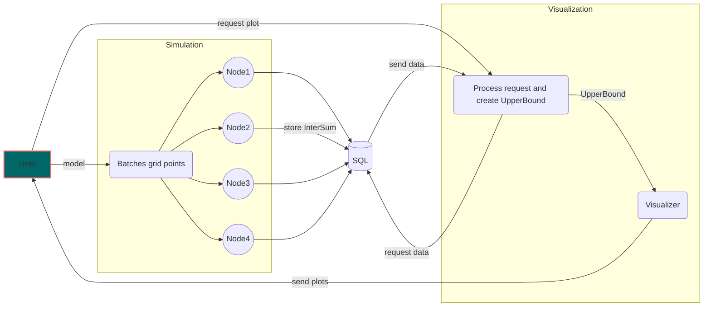

```mermaid
flowchart LR;
    user[User];  
    style user fill:#006666,stroke:#f66,stroke-width:2px
    SQL[(SQL)];
    
    user -->|model| driver;
    subgraph subg_sim [Simulation];
    direction TB;
    driver(Batches grid points);
    driver --> Node1((Node1));
    driver --> Node2((Node2));
    driver --> Node3((Node3));
    driver --> Node4((Node4));
    end;
    Node1 --> SQL;
    Node2 --> |store InterSum| SQL;
    Node3 --> SQL;
    Node4 --> SQL;
    
    user --> |request plot| visproc;
    subgraph subg_vis [Visualization];
    visproc(Process request and create UpperBound);
    visualizer(Visualizer);
    visproc -->|UpperBound| visualizer;
    end;
    visproc --> |request data| SQL;
    SQL --> |send data| visproc;
    visualizer --> |send plots| user;
```
