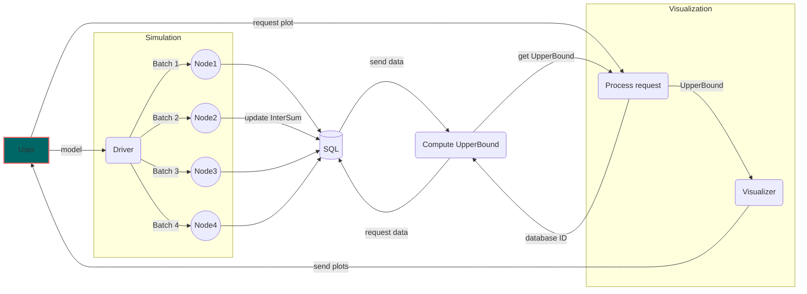

# Kevlar Flowcharts

## Main Flowchart

```mermaid
flowchart LR;
    user[User];  
    style user fill:#006666,stroke:#f66,stroke-width:2px
    SQL[(SQL)];
    ubcomp(Compute UpperBound);

    ubcomp --> |request data| SQL;
    SQL --> |send data| ubcomp;

    user -->|model| driver;
    subgraph subg_sim [Simulation];
        driver(Driver);
        driver --> |Batch 1| Node1((Node1));
        driver --> |Batch 2| Node2((Node2));
        driver --> |Batch 3| Node3((Node3));
        driver --> |Batch 4| Node4((Node4));
    end;
    Node1 --> SQL;
    Node2 --> |update InterSum| SQL;
    Node3 --> SQL;
    Node4 --> SQL;

    user --> |request plot| visproc;
    subgraph subg_vis [Visualization];
        visproc(Process request);
        visualizer(Visualizer);
        visproc -->|UpperBound| visualizer;
    end;
    visproc --> |database ID| ubcomp;
    ubcomp --> |get UpperBound| visproc;
    visualizer --> |send plots| user;
    
```
